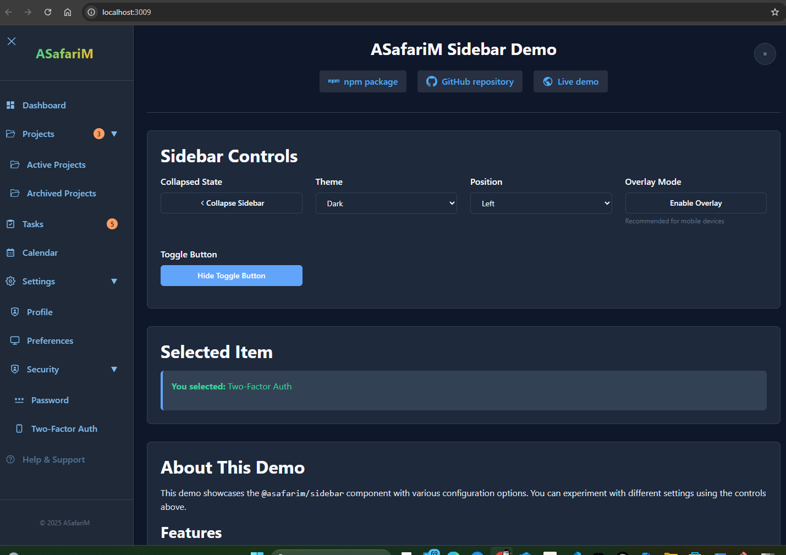

# @asafarim/sidebar

A flexible and customizable collapsible sidebar component for React applications.

## Demo


Goto [demo](./demo/readme.md)

## Features

- 🎯 **Fully Collapsible** - Smooth toggle between expanded and collapsed states
- 🎨 **Themed** - Light and dark theme support
- 📱 **Responsive** - Mobile-friendly with overlay support
- ♿ **Accessible** - Full keyboard navigation and screen reader support
- 🔧 **Flexible** - Highly customizable with multiple configuration options
- 🌲 **Nested Items** - Support for multi-level navigation hierarchies
- 🎪 **Icons & Badges** - Rich visual elements for better UX
- 📍 **Positioning** - Left or right sidebar positioning with dynamic toggle
- 🔘 **Optimized Toggle Button** - Strategically positioned toggle button at the top of the sidebar

## Installation

```bash
npm install @asafarim/sidebar
# or
yarn add @asafarim/sidebar
# or
pnpm add @asafarim/sidebar
```

## Version History

- **1.1.6** - updated publishConfig to public
- **1.1.5** - Added demo image
- **1.1.4** - Added demo folder
- **1.1.3** - Added support for React component icons
- **1.1.2** - Repositioned toggle button, added support for dynamic sidebar positioning
- **1.1.1** - Initial stable release

## Basic Usage

```tsx
import { Sidebar } from '@asafarim/sidebar';
import type { SidebarItem } from '@asafarim/sidebar';

const sidebarItems: SidebarItem[] = [
  {
    id: 'dashboard',
    label: 'Dashboard',
    icon: '📊',
    onClick: () => console.log('Dashboard clicked')
  },
  {
    id: 'projects',
    label: 'Projects',
    icon: '📁',
    children: [
      {
        id: 'my-projects',
        label: 'My Projects',
        icon: '📂'
      },
      {
        id: 'shared-projects',
        label: 'Shared Projects',
        icon: '👥',
        badge: 3
      }
    ]
  },
  {
    id: 'settings',
    label: 'Settings',
    icon: '⚙️',
    url: '/settings'
  }
];

function App() {
  return (
    <Sidebar
      items={sidebarItems}
      logo={<span>My App</span>}
      theme="dark"
      onItemClick={(item) => console.log('Clicked:', item.label)}
    />
  );
}
```

## Props

### SidebarProps

| Prop | Type | Default | Description |
|------|------|---------|-------------|
| `items` | `SidebarItem[]` | **Required** | Array of navigation items |
| `isCollapsed` | `boolean` | `undefined` | Controlled collapsed state |
| `onToggle` | `(collapsed: boolean) => void` | `undefined` | Callback when toggle state changes |
| `sidebarWidth` | `string` | `'280px'` | Width when expanded |
| `collapsedWidth` | `string` | `'60px'` | Width when collapsed |
| `className` | `string` | `''` | Additional CSS class |
| `theme` | `'light' \| 'dark'` | `'light'` | Color theme |
| `position` | `'left' \| 'right'` | `'left'` | Sidebar position |
| `overlay` | `boolean` | `false` | Show overlay on mobile |
| `showToggleButton` | `boolean` | `true` | Show collapse/expand button |
| `logo` | `ReactNode` | `undefined` | Logo/brand element |
| `footer` | `ReactNode` | `undefined` | Footer content for the sidebar |
| `onItemClick` | `(item: SidebarItem) => void` | `undefined` | Item click handler |

### SidebarItem

| Property | Type | Required | Description |
|----------|------|----------|-------------|
| `id` | `string` | ✅ | Unique identifier |
| `label` | `string` | ✅ | Display text |
| `icon` | `string \| ReactNode` | ❌ | Icon (emoji, text, or React component) |
| `url` | `string` | ❌ | Navigation URL |
| `onClick` | `() => void` | ❌ | Click handler |
| `children` | `SidebarItem[]` | ❌ | Nested items |
| `badge` | `string \| number` | ❌ | Notification badge |
| `disabled` | `boolean` | ❌ | Disabled state |

## Examples

### Using React Icons

```tsx
import { Sidebar } from '@asafarim/sidebar';
import type { SidebarItem } from '@asafarim/sidebar';
import { FiHome, FiFolder, FiSettings, FiUsers } from 'react-icons/fi';

const sidebarItemsWithReactIcons: SidebarItem[] = [
  {
    id: 'dashboard',
    label: 'Dashboard',
    icon: <FiHome aria-hidden="true" />,
    onClick: () => console.log('Dashboard clicked')
  },
  {
    id: 'projects',
    label: 'Projects',
    icon: <FiFolder aria-hidden="true" />,
    children: [
      {
        id: 'my-projects',
        label: 'My Projects',
        icon: <FiFolder aria-hidden="true" />
      },
      {
        id: 'shared-projects',
        label: 'Shared Projects',
        icon: <FiUsers aria-hidden="true" />,
        badge: 3
      }
    ]
  },
  {
    id: 'settings',
    label: 'Settings',
    icon: <FiSettings aria-hidden="true" />,
    url: '/settings'
  }
];

function App() {
  return (
    <Sidebar
      items={sidebarItemsWithReactIcons}
      logo={<span>My App</span>}
      theme="dark"
      onItemClick={(item) => console.log('Clicked:', item.label)}
    />
  );
}
```

### Controlled Sidebar

```tsx
function App() {
  const [collapsed, setCollapsed] = useState(false);

  return (
    <Sidebar
      items={items}
      isCollapsed={collapsed}
      onToggle={setCollapsed}
      theme="dark"
    />
  );
}
```

### With Custom Footer

```tsx
<Sidebar
  items={items}
  footer={
    <div style={{ textAlign: 'center', padding: '1rem' }}>
      
      <div>John Doe</div>
    </div>
  }
/>
```

### Mobile Responsive with Overlay

```tsx
<Sidebar
  items={items}
  overlay={true}
  theme="light"
  position="left"
/>
```

### Dynamic Sidebar Position with Custom Footer

```tsx
function App() {
  const [position, setPosition] = useState<'left' | 'right'>('left');
  const [isCollapsed, setIsCollapsed] = useState(false);
  
  // Custom footer with position toggle button
  const footer = (
    <div style={{ display: 'flex', justifyContent: 'space-between', padding: '0.5rem 1rem' }}>
      {!isCollapsed && <p>© 2025 My App</p>}
      <button 
        onClick={() => setPosition(position === 'left' ? 'right' : 'left')}
        aria-label={position === 'left' ? 'Move sidebar to right' : 'Move sidebar to left'}
        style={{ background: 'transparent', border: 'none', cursor: 'pointer' }}
      >
        {position === 'left' ? '❯' : '❮'}
      </button>
    </div>
  );
  
  return (
    <div style={{ display: 'flex', height: '100vh' }}>
      <Sidebar
        items={items}
        isCollapsed={isCollapsed}
        onToggle={setIsCollapsed}
        position={position}
        showToggleButton={true}
        sidebarWidth="260px"
        collapsedWidth="60px"
        theme="dark"
        footer={footer}
        logo={<span>My App</span>}
      />
      <main style={{
        marginLeft: position === 'left' ? (isCollapsed ? '60px' : '260px') : 0,
        marginRight: position === 'right' ? (isCollapsed ? '60px' : '260px') : 0,
        width: `calc(100% - ${isCollapsed ? '60px' : '260px'})`,
        transition: 'margin-left 0.3s ease, margin-right 0.3s ease, width 0.3s ease'
      }}>
        <h1>Main Content</h1>
        <p>Your application content goes here.</p>
      </main>
    </div>
  );
}
```

### Complex Navigation Structure

```tsx
const complexItems: SidebarItem[] = [
  {
    id: 'workspace',
    label: 'Workspace',
    icon: '🏢',
    children: [
      {
        id: 'overview',
        label: 'Overview',
        icon: '📈'
      },
      {
        id: 'team',
        label: 'Team Members',
        icon: '👥',
        badge: '12'
      },
      {
        id: 'projects',
        label: 'Projects',
        icon: '📁',
        children: [
          {
            id: 'active-projects',
            label: 'Active',
            badge: 5
          },
          {
            id: 'archived-projects',
            label: 'Archived',
            badge: 23
          }
        ]
      }
    ]
  }
];
```

## Toggle Button Positioning

In version 1.1.0, the sidebar toggle button has been repositioned to the top of the icon column for better usability. This provides a more intuitive user experience and follows modern UI patterns.

The toggle button is now:

- Positioned at the top-left corner of the sidebar (or top-right when position is set to 'right')
- Styled to match the sidebar theme
- Easily accessible regardless of sidebar content

This positioning makes it more accessible and visible to users, improving the overall navigation experience.

## Sidebar Position Toggle

The sidebar now supports dynamic position toggling between left and right sides of the screen. This can be implemented using a custom footer with a toggle button as shown in the examples above.

When implementing this feature, remember to adjust your main content margins accordingly to maintain proper layout.

## Styling

The component uses CSS modules for styling. You can override styles by providing a custom `className` prop or by targeting the CSS classes directly.

### CSS Custom Properties

```css
.sidebar {
  --sidebar-bg: #ffffff;
  --sidebar-text: #374151;
  --sidebar-hover: #f3f4f6;
  --sidebar-active: #dbeafe;
  --sidebar-border: #e5e7eb;
}

.sidebar.dark {
  --sidebar-bg: #1f2937;
  --sidebar-text: #d1d5db;
  --sidebar-hover: #374151;
  --sidebar-active: #1e40af;
  --sidebar-border: #374151;
}
```

## Accessibility

The sidebar component is built with accessibility in mind:

- Full keyboard navigation support
- ARIA labels and roles
- Screen reader friendly
- Focus management
- High contrast support

## Browser Support

- Chrome (latest)
- Firefox (latest)
- Safari (latest)
- Edge (latest)

## Changelog

### Version 1.1.6

- updated publishConfig to public

### Version 1.1.5

- Added demo image

### Version 1.1.4

- Added demo folder

### Version 1.1.3

- Added support for React component icons (e.g., from react-icons library)
- Updated type definitions to accept both string and ReactNode for icons
- Enhanced documentation with React icons examples

### Version 1.1.0

- Repositioned toggle button to the top of the sidebar icon column
- Added support for dynamic sidebar positioning (left/right)
- Improved styling for toggle button and sidebar components
- Updated prop names for better clarity (`width` → `sidebarWidth`)
- Enhanced documentation with new examples

## License

MIT
# asafarim-sidebar
